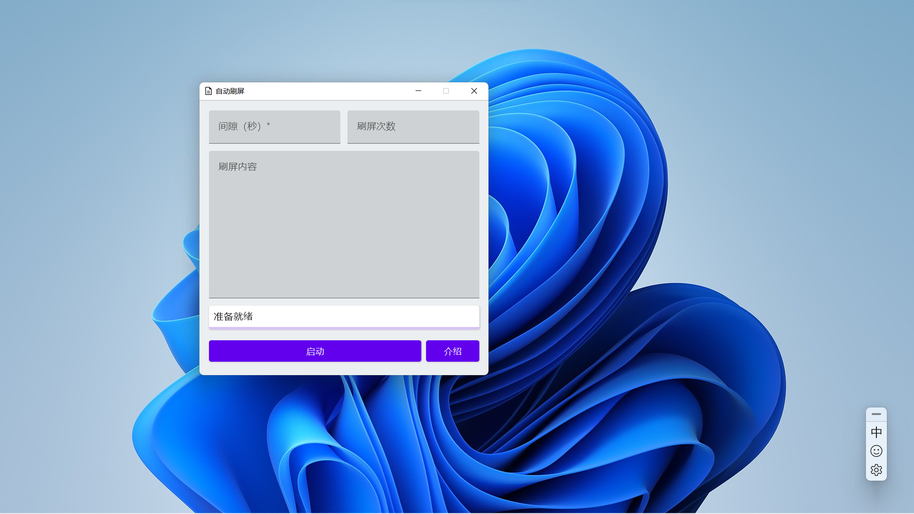

# 自动刷屏

## 简介

* 这是一个用来在各种地方刷屏的电脑程序，[主页](https://giraffat.xyz/autoSpam)

  

## 简单的使用教程

* 输入需要的信息后，点击启动，选中要刷屏的文本输入框，等待4秒即可开始刷屏

* 需要停止刷屏时，可以按程序上的停止按钮，也可以把鼠标移动到屏幕左上角，程序会自动停止

* 如果不填写刷屏次数，程序会进入无限刷屏模式；

* 如果不填写刷屏内容，程序会使用当前剪贴板的内容刷屏

## 自我介绍

* 我是沈御程，兴南中学七年三班的“老班长”